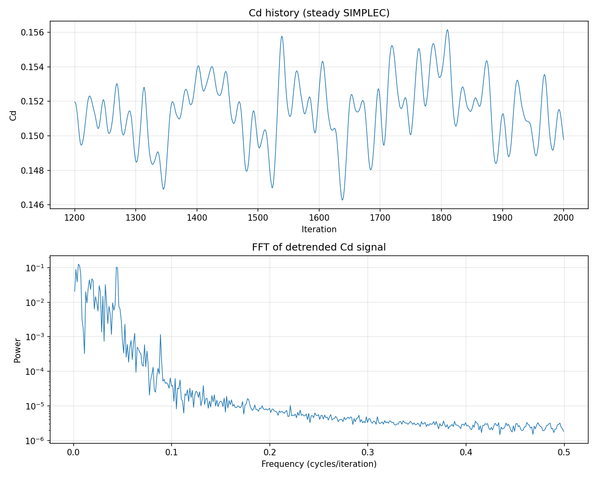
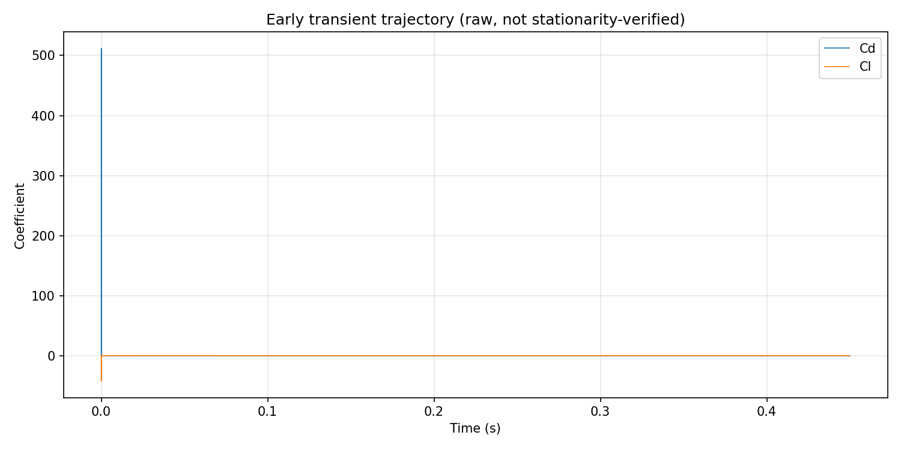
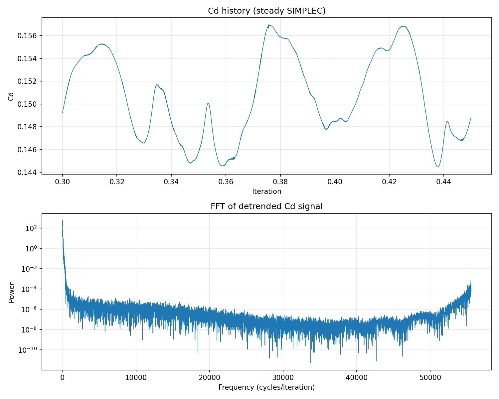
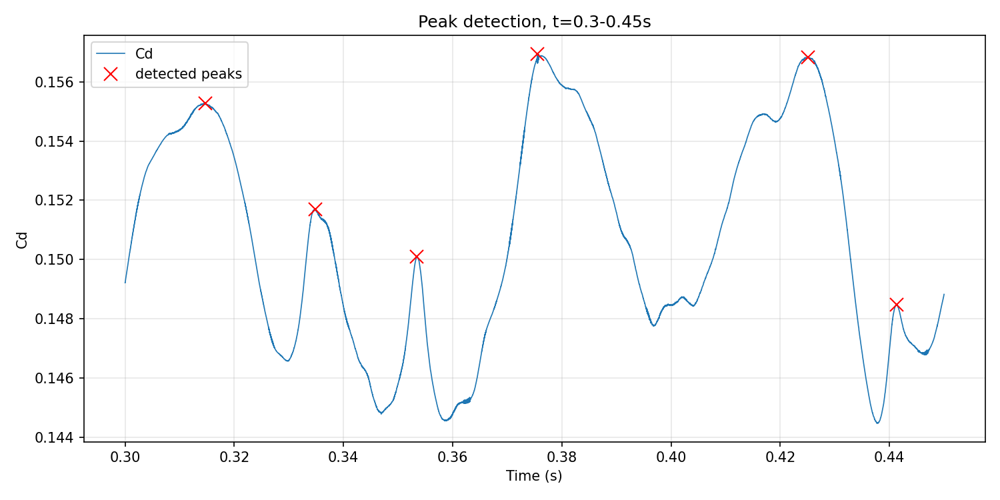
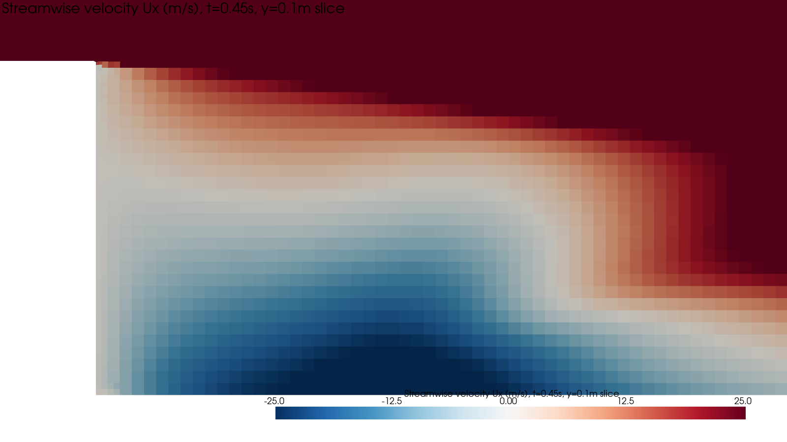
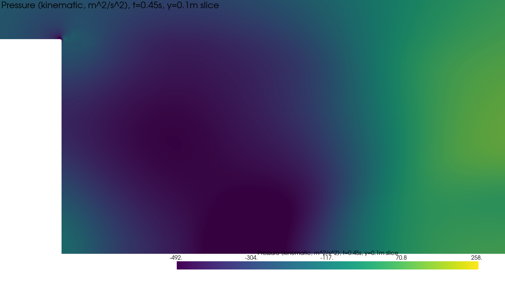
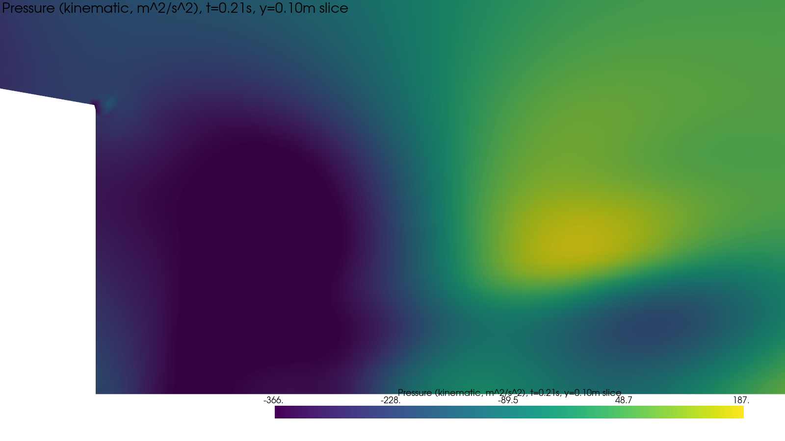
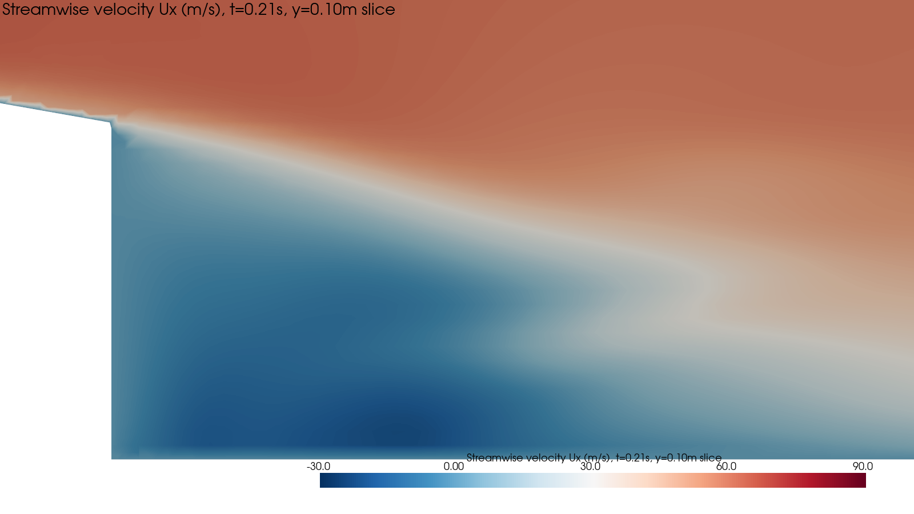
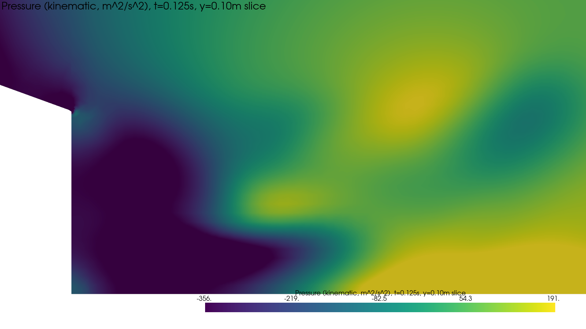
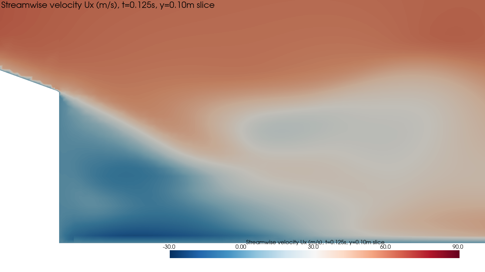

# Project 01 — Ahmed Body: 25° Slant, External Aerodynamics

## Status
**Case frozen at commit `72af160`.** The 25° slant / 60 m/s condition is
complete: mesh validated, steady and transient CFD results obtained,
wake dynamics cross-validated against an independent probe measurement.
No further changes will be made to this case. Work is proceeding to
additional slant angles in the case matrix.

**Update:** the 0° slant angle case has completed mesh generation,
steady-baseline analysis, and a transient PIMPLE investigation with an
honest, inconclusive frequency result — see Section 10.5. The 10°
case has completed the same full pipeline, including flow
visualization; its transient frequency result is also inconclusive,
but for a different and better-characterized reason (visible
amplitude modulation, not simple noise) — see Section 10.6. The 20°
case has also completed the same full pipeline (steady baseline
skipped entirely by decision, not just shortened); its transient
frequency result is likewise inconclusive, this time due to too few
measured cycles (CoV 43% on only 3 intervals) rather than amplitude
modulation or drift — see Section 10.7, which also documents a newly
found peak-detection prominence-sensitivity issue. Remaining angles
(30°, 35°) still pending.

---

## 1. Engineering Objective

Investigate the aerodynamic behavior of the Ahmed body at a 25° rear
slant angle — the angle most studied in the literature and the one
with the most reliable published reference data (Ahmed et al. 1984;
Lienhart & Becker 2003) — using RANS CFD, with explicit verification
and validation at every stage.

**Reference configuration**
- Geometry: standard Ahmed body, length L = 1.044 m, width W = 0.389 m,
  height H = 0.288 m, 25° rear slant, 50 mm ground clearance, 100 mm
  front-nose fillet radius (approximation of the real, digitized nose
  profile — see Section 8)
- Freestream velocity: U∞ = 60 m/s (Ahmed 1984 convention)
- Reynolds number: Re_L = U∞L/ν = 4.18×10⁶ (ν = 1.5×10⁻⁵ m²/s)
- Turbulence model: k-ω SST (RAS)

**Research question**: can steady and transient RANS reproduce the
known separation and wake-unsteadiness behavior of the Ahmed body at
this slant angle, and what does the resulting drag/wake signal show
about the applicability of a steady-state assumption to this flow?

---

## 2. Geometry and Domain

- Parametric geometry generated in CadQuery (`geometry/generate_ahmed_body.py`),
  matching Ahmed (1984) dimensions exactly, with the front nose modeled
  as a tangent-fillet approximation (R = 100 mm, corroborated by two
  independent literature sources) rather than the raw digitized scan
  data (see Section 8, Limitations).
- Computational domain: half-domain with a symmetry plane at the
  vehicle centerline (y = 0), exploiting the zero-yaw symmetry of the
  mean flow. Domain extent: 2L upstream, 6L downstream, 1L half-width,
  2L height (x ∈ [−2.088, 6.264] m, y ∈ [0, 1.044] m, z ∈ [0, 2.088] m).
- Ground: stationary no-slip wall (matching the actual Ahmed 1984 and
  Lienhart & Becker 2003 wind-tunnel setups — neither used a moving
  belt).
- Top and outer (far-field) boundaries: slip walls.

---

## 3. Mesh Strategy and Validation

### 3.1 Wall treatment decision
The project initially targeted a **wall-resolved** (y+ ≈ 1) near-wall
strategy with an 18-layer boundary-layer stack, the standard choice
for maximizing separation-prediction accuracy in RANS. This was
**abandoned** after extensive investigation (see Section 9) found a
geometric incompatibility between automated boundary-layer extrusion
and the Ahmed body's rear trihedral corners (where the slant edge,
side edge, and rear vertical face converge), independent of layer
count, domain size, or available hardware.

The project pivoted to a **high-Re wall-function** strategy:
`nutkWallFunction` / `kqRWallFunction` / `omegaWallFunction`, targeting
y+ = 30–300 (the documented valid range for these OpenFOAM 11 boundary
condition implementations, verified against the source code and a
matching external-vehicle-aerodynamics tutorial, not assumed). No
boundary-layer/prism cells are used; near-wall resolution is provided
entirely by isotropic surface refinement.

### 3.2 Mesh generation and verification
- Generated with `snappyHexMesh`, surface refinement level (6,7) on
  the body (steady case): **2,725,204 cells**.
- `checkMesh`: **Mesh OK** — max non-orthogonality 32.9°, max skewness
  0.95, max aspect ratio 3.42, zero illegal faces in every category.
- Independent y+ verification (`scripts/compute_yplus_layer.py --wallfunction`):
  the chosen refinement level places wall-adjacent cells at y+ ≈ 97–194
  for this Re/velocity, within the intended 30–300 wall-function range
  — confirmed analytically before the mesh was trusted, not assumed
  from the refinement level alone.

---

## 4. Steady RANS Baseline (SIMPLEC)

Solved with `foamRun -solver incompressibleFluid`, k-ω SST, SIMPLEC
(`consistent yes`), `residualControl` at 1×10⁻⁴ for p, U, k, ω.

**Result**: residuals decreased substantially over the first 1000
iterations, then **plateaued** between iterations 1000–2000 (only ω
ever converged below the 1×10⁻⁴ threshold). Drag coefficient did not
converge to a fixed point — instead:

| Quantity | Value |
|---|---|
| Cd mean (iterations 1000–2000) | 0.152808 |
| Cd standard deviation | 0.001670 |
| Dominant oscillation period (FFT) | 17.26 iterations |
| Peak/background spectral power ratio | 167,354× |

This is an extremely clean, unambiguous **limit cycle** in the
solver's iteration history — residuals and Cd oscillate around a
stable mean rather than converging to a point. Because iteration count
in a steady SIMPLEC solve is a pseudo-time relaxation parameter, not a
physical timestep, this period has **no direct physical-time or
frequency interpretation** on its own — but its existence motivated
the transient investigation below.

---

## 5. Transition to Transient (PIMPLE)

Converted the case to transient PIMPLE to determine whether the
observed limit cycle reflects genuine flow unsteadiness. Turbulence
model, wall treatment, and boundary conditions were kept unchanged;
only the time-integration approach changed (see Section 9 for the two
non-trivial bugs found and fixed during this conversion).

**Mesh resolution trade-off**: the full 2.7M-cell mesh, even
parallelized across 8 MPI ranks, required an impractical wall-clock
time to reach a statistically useful physical duration given
hardware/thermal constraints on the development machine. The mesh was
coarsened in two documented steps for the transient run only (the
steady-case mesh above is unaffected):

| Stage | Refinement level | Cells | Notes |
|---|---|---|---|
| Steady baseline | (6,7) | 2,725,204 | Fully validated, used for Section 4 |
| Transient, step 1 | (5,6) | 1,264,455 | `Mesh OK`, verified stable |
| **Transient, final** | **(4,5)** | **872,391** | `Mesh OK`, used for all transient results below |

**Final transient configuration**: 872,391 cells, 8 MPI ranks
(hierarchical decomposition, balanced to <0.1% cell-count deviation),
`maxCo = 0.5` (`adjustTimeStep` active), initial `deltaT` computed
from actual mesh/velocity data (not guessed).

Measured performance: **~2.4 s/timestep** (mean), pressure (GAMG) the
dominant per-timestep cost (mean 6.4 iterations, up to 22), consistent
with standard incompressible-PIMPLE cost distribution.

---

## 6. Transient Results

### 6.1 Stationarity
Starting from uniform initial conditions (not the steady-state result
— see Section 9.2), the flow was run to t = 0.20 s. Windowed-mean
analysis (0.02 s windows) showed the initial startup transient
resolving by t ≈ 0.045–0.06 s, after which windowed Cd means agreed
within ~1–2% of each other with no systematic drift. **The flow reaches
statistical stationarity by t ≈ 0.06 s** (≈3.4 body-length
flow-through times).

Selected stationary analysis window: **t = 0.06–0.20 s**.

### 6.2 Statistics (stationary window, t = 0.06–0.20 s)

Computed directly from the concatenated `forceCoeffs.dat` output
(`scripts/compute_stationary_stats.py`), n = 7281 samples, restricted
to t = 0.06–0.20 s, with leftover steady-case pseudo-time directories
excluded (see script header for details).

| Quantity | Cd | Cl |
|---|---|---|
| Mean | 0.1619 | 0.1204 |
| Std. dev. (raw, stationary window) | 0.0039 | 0.0500 |
| Min / max | 0.1563 / 0.1698 | 0.0492 / 0.1936 |
| Sub-window mean range (4 equal sub-windows) | 0.1606–0.1628 | — |

**Caveat, stated explicitly**: Cl showed measurably more residual
linear drift within the stationary window (~9.7% over the full
window) than Cd (~0.9%) — Cd statistics are more trustworthy than Cl
statistics from this run. The raw Cl std dev above (0.0500) is ~41%
of the Cl mean, a large relative spread that is consistent with —
not a resolution of — this drift concern: it should be read as
further evidence that Cl has not reached a stationary state in this
window, not as a validated fluctuation amplitude. Cd's std dev
(0.0039, ~2.4% of its mean) does not show this problem.

### 6.3 Frequency and Strouhal number

Both Cd and Cl gave **identical** dominant frequency in every window
tested. Time-domain peak-to-peak measurement (more reliable than the
FFT bin estimate, given the limited number of cycles available) across
two independent 0.07 s sub-windows agreed to within ~1%:

| Metric | Value |
|---|---|
| Time-domain period (sub-window 1) | 0.01523 s (CoV 0.81%) |
| Time-domain period (sub-window 2) | 0.01538 s (CoV 0.06%) |
| Corresponding frequency | ≈ 65.4 Hz |

**Independent wake-probe cross-check**: sampled velocity at a fixed
near-wake point (x = 1.15, y = 0.10, z = 0.15 m) using the already-saved
transient field data (no re-solving). All three velocity components
independently gave the same dominant frequency, in close agreement
with the force signal:

| Signal | Frequency |
|---|---|
| Integrated force (Cd/Cl) | 65.36 Hz |
| Near-wake velocity probe | 65.57 Hz |
| **Agreement** | **0.33%** |

**Strouhal number — characteristic length verified against
literature, not assumed**: Ahmed-body wake-shedding studies
(Thacker et al. 2010, on this same 25° geometry; aspect-ratio wake
studies) define St using body **height H**, not length L (L is the
correct convention for Re in this project, but a different quantity):

St = f·H/U∞, H = 0.288 m → **St ≈ 0.31–0.34**

Published values for comparable Ahmed-body slant/wake shedding modes:
Thacker et al. (2010), 0.18–0.21 (slant-surface shedding); aspect-ratio
studies, 0.24 (C-pillar contraction/expansion mode). Our result is the
same order of magnitude but on the higher end of published values —
most plausibly attributable to the coarsened transient mesh (Section 6
mesh table), not re-verified via a transient mesh-independence study.

### 6.4 Wake visualization

Velocity contours on a longitudinal slice through the near wake,
across 7 timesteps spanning ~2 shedding cycles, show a reverse-flow
recirculation bubble immediately behind the slant surface with
**visibly changing size and shape** cycle-to-cycle — elongating and
contracting rather than static. This is consistent with the
**"bubble pumping"** mechanism specifically documented in the
literature for this geometry (cyclic contraction/expansion of the
near-wake recirculation bubble), rather than confirmed classical
alternating vortex shedding, which was not distinguished with
certainty from this evidence alone.

---

## 7. Engineering Conclusions

1. **A genuinely steady RANS solution does not exist for this flow at
   this slant angle** — the persistent, high-quality limit cycle in
   the steady solve, combined with the transient run's sustained
   periodic wake oscillation, is strong, convergent evidence of real
   flow unsteadiness that a steady formulation cannot resolve to a
   fixed point.
2. **The observed ~65 Hz oscillation is a physically real wake
   phenomenon**, not a numerical artifact — supported by three
   independent lines of evidence: (a) internal consistency between Cd
   and Cl (identical frequency, 0% difference), (b) cross-validation
   against an independent wake-velocity probe (0.33% agreement), and
   (c) visual confirmation of an evolving recirculation structure
   consistent with a literature-documented mechanism.
3. The corrected Strouhal number (St ≈ 0.31–0.34, using the
   literature-verified height-based convention) is in the right order
   of magnitude relative to published values, though higher than the
   most directly comparable literature figures — a limitation
   attributed to mesh coarsening, not treated as a validated match.

---

## 8. Limitations — What Should Not Be Concluded

- **The transient mesh (872,391 cells, level 4,5) is coarsened ~3.1×**
  from the mesh validated for the steady case. No mesh-independence
  study was performed at this transient resolution. The frequency and
  Strouhal number above should be read as a genuine, cross-validated
  qualitative finding, not a quantitatively converged result.
- **No mean/RMS Cd or Cl value from this project has been compared to
  Ahmed (1984) or Lienhart & Becker (2003) experimental data.** Doing
  so would require, at minimum, matching the exact experimental
  Reynolds number condition (this project's 40 m/s / Re 2.78×10⁶
  Lienhart & Becker case remains unexecuted) and a mesh-independence
  study — neither of which has been done.
- **The front nose is a tangent-fillet approximation** of the real,
  digitized nose profile (documented and justified in
  `validation/reference_data/README.md`), not the exact experimental
  geometry.
- **Cl statistics carry more uncertainty than Cd** due to observed
  residual drift within the nominally stationary window (Section 6.2).
- **The wake mechanism is identified as consistent with "bubble
  pumping,"** based on visual inspection of 7 timesteps — this is not
  a rigorous mode-decomposition (e.g. POD/DMD) analysis, and classical
  alternating vortex shedding has not been definitively ruled out as a
  contributing or alternative mechanism.
- **All decisions on mesh resolution, run duration, and rank count in
  the transient study were driven partly by hardware/thermal
  constraints** on the development machine, not purely by numerical
  or physical criteria — stated explicitly rather than presented as
  independent scientific choices.

---

## 9. Development & Troubleshooting (summary)

The full, unabridged investigation — every dead end, failed
configuration, and correction — is preserved in
`mesh/mesh_development_log.md`. Summary of the load-bearing findings:

**9.1 — Wall-resolved meshing failure.** Six-plus mesh iterations at
increasing refinement, multiple `resolveFeatureAngle` values, and
layer counts from 18 down to 5 all failed during boundary-layer
extrusion, either crashing the machine or producing zero retained
layers. Root cause, isolated via direct spatial analysis of
`cellLevel` data: severe cell inversion concentrated at the two rear
trihedral corners, independent of mesh size (reproduced on a mesh
6,300× smaller than the full-resolution attempt). A rear-corner fillet
was investigated and rejected on literature grounds (real Ahmed-body
corners are sharp; rounding them measurably changes drag). This
motivated the wall-function pivot (Section 3.1).

**9.2 — Transient conversion bugs.** (a) `ddtSchemes` in `fvSchemes` —
not `controlDict` or `fvSolution` — controls steady vs. transient
solver mode in OpenFOAM 11 (verified directly from source code); a
correctly-configured PIMPLE/timestep setup silently ran in steady mode
until this was found. (b) The steady SIMPLEC solution's `phi` (flux)
field is inconsistent with a PIMPLE/PISO transient restart, producing
Courant numbers wrong by 5 orders of magnitude; resolved by starting
the transient run from uniform initial conditions instead of
attempting flux reconstruction.

**9.3 — Frequency-analysis correction.** An initial FFT on the raw,
non-uniformly-sampled transient Cd(t) signal produced a spurious
"dominant period" equal to the analysis window length — an artifact of
analyzing a still-decaying envelope. Caught by comparing the FFT
result against a direct visual inspection of the signal and a
time-domain peak count, then corrected by resampling to a uniform grid
and restricting to the verified-stationary window (Section 6.1) before
recomputing.

**9.4 — Strouhal characteristic-length error.** An initial calculation
using body length L gave St ≈ 1.14 — implausible for bluff-body wake
shedding. Literature verification found the wake-shedding convention
uses body height H, not L (L remains correct for this project's
Reynolds number definition, a different, unrelated quantity). This is
documented as a genuine error, caught before being reported as final.

---

## 10. Reproducibility

All geometry generation, meshing, case setup, and post-processing
scripts are under `geometry/`, `mesh/`, and `scripts/`. Case
dictionaries for all three case variants (steady wall-resolved
attempts, steady wall-function baseline, transient) are under
`cases/`. Raw solver field/mesh data is excluded from version control
(regenerable from scripts and dictionaries); quantitative results are
preserved as `.npz` arrays and the figures in `results/`.

---

## 10.5. Case Matrix Progress — 0° Slant Angle (60 m/s)

*Note: this section is a running log entry for the slant-angle sweep,
added in the case's own working style rather than fully integrated
into the numbered structure above. Will be consolidated when the
README is rewritten after the full sweep completes.*

**Case**: `slant00_re4.18M_symtest`. Same domain, BCs, turbulence
model, and wall-function strategy as the 25° case (Sections 2-3),
carried over as starting hypotheses and independently re-verified for
this geometry rather than assumed.

### Geometry
STL verified: 332 triangles, watertight, meter-scale (L=1.044,
W=0.389, H=0.288 m), volume 114.44 L — the largest in the sweep, as
expected (least material removed at 0° slant; monotonic with the 25°
body's 110.77 L).

### Feature-angle investigation (new finding, not present in the 25°
### workflow in this form)
An independent PyVista-based feature-edge sweep and OpenFOAM's own
`surfaceFeatures` utility were both used to determine
`includedAngle`/`resolveFeatureAngle` for this geometry. This
surfaced an important correction: **OpenFOAM's `includedAngle`
convention is the opposite of what a naive reading of PyVista's
`feature_angle` parameter suggests** — in OpenFOAM, higher values
select MORE edges (180°=all edges, 0°=none), confirmed against source
documentation, not assumed.

A systematic angle sweep of OpenFOAM's actual `surfaceFeatures` output
(`scripts/sweep_included_angle.py`) found a clean, unique answer:
**`includedAngle 90` / `resolveFeatureAngle 90`** — exactly 8 genuine
edges (4 rear box corners + 4 fillet-to-flat tangent-line corners),
zero tessellation noise. At 89°: 0 edges detected at all. At 91° and
above: edge count climbs continuously with no plateau, picking up
fillet tessellation noise. This is a materially different value from
the 25° case's 120°, because 0° geometry has plain right-angle box
corners (no slant face), structurally different from 25°'s oblique
slant/roof edges. **Confirms feature-angle settings do not transfer
between slant angles and must be independently re-derived per case**
— consistent with the project's standing "no assumed methodology
transfer" principle (see Section 8/9 of the original workflow).

### Mesh
- `blockMesh`: 32,500 background cells — identical to the 25° case,
  as expected (domain sizing is angle-independent, Section 2).
- `snappyHexMesh`: the wall-function strategy (`addLayers false`,
  surface refinement level (6,7)) was carried over from the validated
  25° mesh as a starting hypothesis, **not assumed valid** — it
  generalized successfully to this geometry. Result: 2,316,063 cells
  (vs. 2,725,204 at 25°).
- `checkMesh`: **Mesh OK.** Max non-orthogonality 44.9° (vs. 32.9° at
  25°), max skewness 0.90 (vs. 0.95), max aspect ratio 4.26 (vs.
  3.42). All comfortably within quality thresholds; the differences
  are plausibly attributable to the sharp 90° corner geometry vs.
  25°'s beveled slant, though this has not been independently
  verified by inspecting where in the mesh these maxima occur.

### Steady RANS baseline (SIMPLEC)
Ran to 2000 iterations. A mid-run issue was found and corrected: the
case's `controlDict` was discovered with `endTime 1000` instead of the
intended `2000` (root cause not conclusively identified — most likely
a copy/edit inconsistency, not a deeper problem); the run was resumed
via `startFrom latestTime` after fixing the value, with no other
changes.

Residuals plateaued in the same qualitative pattern as the 25° case:
Ux/Uy/Uz/p remained elevated (~1e-3 to 1e-2), only k/omega converged
below the 1e-4 threshold.

**Cd/FFT analysis required correcting two methodological errors before
reaching a reliable conclusion — documented here because catching
these errors is as important as the final result, per the project's
standing integrity principle:**

1. An initial full-window (iterations 1000-2000) FFT reported a
   "dominant period" of 200.20 iterations; a half-window (1000-1500)
   FFT reported 250.50 iterations. Both values are simple fractions of
   their respective window lengths (1000/5 and 500/2) — the same
   window-length-tracking artifact previously identified and corrected
   in the 25° transient-case frequency analysis (Section 6.3 /
   Section 9.3 above). Neither was a real signal.
2. A sliding-window sweep (`scripts/sweep_steady_windows.py`, using
   proper linear detrending rather than mean-subtraction) found a
   period that stays consistent across multiple window lengths (200,
   300, 500 iterations) and multiple start points, whenever the
   window's internal linear trend was small: **~22.2-22.7 iterations**.
   A subsequent single-window [1200,2000] FFT, even after correcting
   the analysis script to use full linear detrending, still returned a
   window-length-fraction artifact (200.25 ≈ 800/4) as its single
   strongest peak. Reporting the top 5 spectral peaks (rather than
   only the strongest) resolved this: the genuine ~22.5-iteration
   signal was present and reasonably strong (ranks 3-4, power ratio
   ~20,000x), while three window-length-fraction artifacts (800/2,
   800/4, 800/5) dominated the top of the ranking — a clear
   spectral-leakage signature (multiple peaks aligning with simple
   fractions of one window length) rather than independent physical
   modes.

**Final result**: Cd mean (iterations 1200-2000) = 0.151413,
std = 0.001857. Genuine limit-cycle period ≈ 22.5 iterations —
distinct from the 25° case's 17.26-iteration steady-solve period.

**Conclusion**: steady RANS does not converge to a fixed point at 0°
either, consistent with the 25° finding. The underlying physical
mechanism has not been independently confirmed to be the same kind of
unsteadiness (no wake visualization has been done for 0° yet, unlike
25°'s visually-confirmed "bubble pumping" mechanism) — this parallel
is currently based on the Cd/residual signature alone, not
cross-validated the same way 25° was.

### Transient PIMPLE investigation

Following the same decision as the 25deg case (steady RANS shows a
genuine limit cycle, not a fixed point), the case was converted to
transient PIMPLE. Mesh coarsened using the same strategy validated at
25deg (level (6,7)->(4,5)), but required an independent fix: the
default `nCellsBetweenLevels 3` caused persistent, non-convergent
castellation oscillation (22-49 cells/iteration, 45+ iterations, never
reaching `minRefinementCells`) with both explicit-feature and
refinement-shell selection criteria reporting 0 -- confirming the
oscillation was buffer/transition-layer driven, not caused by the
wake-refinement-box level or position (both tested and ruled out).
Reducing `nCellsBetweenLevels` to 2 resolved it cleanly (851,401 cells,
`checkMesh` OK, though max aspect ratio 6.20 is the highest seen in
this project to date -- a real, accepted trade-off of this fix, not
verified against solver stability beyond the runs performed).

**Numerical tolerance trade-off, explicitly accepted**: to reduce
wall-clock time given repeated hardware/scheduling constraints, the
PIMPLE pressure-solver tolerances were loosened from the 25deg case's
values (`pFinal` absolute tolerance 1e-7 -> 1e-4; non-final `p`
`relTol` 0.01 -> 0.05), giving roughly 19% faster wall-clock time per
unit of physical time. This measurably increased the reported "global"
time step continuity error (from consistently near-zero/scattered at
~1e-14 to a value that showed a monotonic within-stage drift up to
~1e-13), though the absolute magnitude remains small relative to the
flow. This is a genuine, documented deviation from the 25deg case's
numerical settings, not a like-for-like comparison at the solver
level.

**Data-integrity incident**: the run was interrupted by power outages
on two separate occasions, each truncating the actively-written
`forceCoeffs.dat` file mid-record and producing a single NaN row per
incident. These were identified and are now automatically dropped by
all analysis scripts (`load_forcecoeffs` in
`scripts/{analyze_steady_cd,inspect_early_transient,estimate_period_peaks}.py`)
before deduplication -- confirmed the solver's own field data was
unaffected (`startFrom latestTime` correctly resumed from the last
valid write in each case), only the diagnostic force-coefficient log
had truncated trailing rows.

**Frequency/period result: inconclusive, documented honestly rather
than forced to a number.** Peak-to-peak period measurements across
progressively larger windows ([0.2,0.3], [0.3,0.45]) consistently
showed high variability (CoV 46-48%) that did NOT improve with more
data, unlike the clean convergence seen in the 25deg case's frequency
analysis (CoV <1%). Measured inter-peak periods in the [0.3,0.45]s
window were 0.0201, 0.0186, 0.0221, 0.0495, 0.0163 s -- three
similar short periods, one notably longer gap, one short -- confirmed
via re-detection at a lower prominence threshold to be a genuine
feature of the signal (not a missed-peak artifact: no hidden cycle
exists in the long gap). **This is read as tentative evidence that
the 0deg wake oscillation may be irregular or amplitude-modulated
rather than single-frequency, unlike 25deg's clean ~65 Hz signal** --
but this is not confirmed with confidence, given the limited total
runtime (0.45s) relative to what would be needed to establish this
rigorously (e.g. via proper spectral analysis with many more cycles,
or POD/DMD mode decomposition, neither of which was performed).

**Flow-field visualization**: a single-instant snapshot at t=0.45s
(streamwise velocity and pressure contours, y=0.10m longitudinal
slice, same slice convention as the 25deg case). This is explicitly
NOT a wake-evolution sequence like 25deg's 7-frame recirculation-
bubble visualization -- only two near-identical timesteps (t=0.449,
t=0.45, 0.001s apart) survived in the actual oscillation region of
this run, insufficient to show temporal evolution. The snapshot shows
a reverse-flow recirculation region (Ux down to -30 m/s against a
freestream that locally accelerates to ~85 m/s) coincident with a
clear low-pressure core (down to ~-492 m^2/s^2, recovering toward
freestream pressure downstream) -- consistent with the base-pressure
signature of a near-wake recirculation bubble, structurally similar in
character to 25deg's wake, though not confirmed as the same specific
mechanism ("bubble pumping" vs. other unsteadiness) given the single-
instant limitation. This provides a physical, visual cross-check that
the flow structure is sensible and consistent with the Cd/Cl
oscillation already documented, but does NOT independently confirm
the frequency/period finding above, which remains inconclusive.

### Decision: transient-by-default for remaining angles
Given two consecutive, independently-analyzed angles (0°, 25°) both
show genuine steady-RANS non-convergence via a real limit cycle (not a
numerical bug in either case), the remaining sweep angles (10°, 20°,
30°, 35°) will proceed directly to transient PIMPLE, preceded by only
a short (~200-300 iteration) steady sanity check per angle — not a
full 2000-iteration run — to cheaply catch gross setup errors (bad
BCs, mesh/field mismatches) before committing to transient compute
time.

This is treated as a **working assumption for this sweep, not a
proven universal result**. In particular, 10°/20°/30° sit at or near
Ahmed's documented drag-crisis transition, where the wake flow
topology changes qualitatively (from more 3D, fully-separated flow to
more 2D/attached-like behavior on the slant, or vice versa depending
on direction of comparison) — it is not guaranteed that whatever
produces non-convergence at 0° and 25° generalizes to that regime, and
the short steady sanity-check is retained specifically to catch a
surprise convergence result if one occurs, rather than assuming all
five angles will behave identically.

### New scripts developed for this case (reusable for future angles)
- `scripts/sweep_included_angle.py` — runs OpenFOAM's actual
  `surfaceFeatures` utility across a range of `includedAngle` values
  and classifies extracted feature points by spatial region, to find
  a clean feature-angle threshold without guessing.
- `scripts/analyze_steady_cd.py` — Cd/Cl windowed-mean and FFT
  stationarity analysis for a steady-state case, updated during this
  investigation to use full linear detrending (not mean-only) and to
  report the top 5 spectral peaks rather than only the strongest, both
  changes made specifically because the mean-only/top-1 approach
  produced misleading results on this case's data.
- `scripts/sweep_steady_windows.py` — sliding-window sweep across
  multiple window lengths and start points, used to distinguish a
  genuine oscillation period (stable across window choices) from a
  window-length FFT artifact (period tracks window size).
- `scripts/inspect_early_transient.py` — quick raw Cd/Cl trend
  inspection for early-transient data, before a stationarity window is
  expected to exist yet.
- `scripts/compute_transient_deltat.py` — computes initial transient
  deltaT from the actual generated mesh's finest cell size (direct
  cell-extent measurement, cross-checked against a volume-based cube-
  root proxy), rather than assuming a value from a different case's
  mesh.
- `scripts/estimate_period_peaks.py` — time-domain peak-to-peak period
  estimation for transient Cd(t) signals, for cases with too few
  cycles for a reliable FFT; reports CoV across measured periods
  explicitly, with a caution flag when fewer than 3 periods are
  available.
- `scripts/visualize_snapshot.py` — single-instant velocity/pressure
  contour visualization on a longitudinal slice; prints actual field
  data statistics before rendering and auto-detects outlier-dominated
  color scales (switching to percentile clipping), after an initial
  render produced a misleadingly flat pressure plot traced to a few
  extreme outlier cells dominating a naive min/max color range.

All three shared-loading scripts (`analyze_steady_cd.py`,
`inspect_early_transient.py`, `estimate_period_peaks.py`) now also
drop NaN rows before deduplication, to handle truncated writes from
power interruptions (see Data-integrity incident above).

## 10.6. Case Matrix Progress — 10° Slant Angle (60 m/s)

*Same running-log style as Section 10.5, not yet integrated into the
numbered structure above.*

**Case**: `slant10_re4.18M_symtest` (steady sanity check) and
`slant10_re4.18M_symtest_transient` (transient PIMPLE).

### Geometry
STL verified: 336 triangles, watertight, volume 112.7976 L — correctly
between the 0° body's 114.44 L and the 25° body's 110.77 L, monotonic
as expected.

### Correction to the feature-angle methodology (important — affects
### how the 0° and 25° feature-angle work above should be read)

The 0° and 25° feature-angle investigations (Section 10.5, Section 3)
both swept OpenFOAM's `surfaceFeatures` utility over `includedAngle`
and then set `resolveFeatureAngle` (in `snappyHexMeshDict`) to the
same numeric value found for `includedAngle` (in
`surfaceFeaturesDict`), on the assumption that the two settings
describe the same edge-selection concept. **This assumption is wrong,
and the mesh only reads one of the two settings.**

Direct inspection of every case's `snappyHexMeshDict` (0°, 10°, 25°,
and their transient variants) shows `features ( );` — an empty
explicit-feature list — in all of them. `snappyHexMesh`'s own log
confirms `distance to explicit features : 0 cells` in every case.
**The `.eMesh` file produced by `surfaceFeatures`/`includedAngle` has
never been read by any mesh built in this project.** All of the
"verified genuine edge" analysis built on that sweep (0°'s 8 edges,
10°'s originally-claimed 10 edges, 25°'s edge count) is a valid,
independently-useful geometric characterization of the STL, but it
was never wired into any mesh's refinement.

The setting that *does* act on the mesh is `resolveFeatureAngle`,
read directly from the OpenFOAM 11 source
(`refinementParameters.C`): it is converted to
`curvature = cos(resolveFeatureAngle)`, and a cell is marked for
curvature refinement where two neighboring surface-triangle normals
satisfy `dot(n_i, n_j) < curvature` — i.e., **refinement fires where
adjacent normals differ by MORE than `resolveFeatureAngle`**. This is
a materially different quantity from `includedAngle`
(`180° − includedAngle`, given this project's already-verified
`includedAngle` convention), not the same number expressed twice.

**Consequence, confirmed from mesh logs**: at `resolveFeatureAngle 90`
(0° and 10°), this rule fires on every 90° box-corner edge on this
body (0°: 3,229 cells marked; 10°: 2,607 cells marked, steady mesh).
At `resolveFeatureAngle 120` (25°, both steady meshes), the rule
**cannot fire at all** on this body, since no edge here has a normal
angle exceeding 90° — confirmed directly: `curvature/regions : 0
cells` in every 25° `snappyHexMesh` log checked. So the 0°/10° meshes
received curvature-based edge refinement and the 25° meshes did not —
an unintended, previously undocumented cross-angle mesh difference,
now corrected here rather than left standing.

Separately, and for 10° specifically: the `includedAngle 90` sweep's
9-edge set was re-examined and found to **not** include the
slant-to-rear edge (the edge where the slanted roof meets the vertical
rear face — the geometry most relevant to separation at a slanted
Ahmed body) or the roof-to-slant crease. Both are real, physically
important edges; they are simply not selected at `includedAngle 90`
(the slant-to-rear edge's included angle is ~100° for a 10° slant,
just above the 90°/91° threshold verified for this body's plain box
edges). The dictionary comments describing these as "captured" and
"verified" for 10° were incorrect and have been corrected in the case
files themselves (`system/surfaceFeaturesDict`,
`system/snappyHexMeshDict`).

**Decision for the 10° transient mesh** (`resolveFeatureAngle`, given
the above): kept at 90, matching 0°, rather than switching to 120 to
match 25° or to a value that would capture the slant-to-rear edge
(which would require ~100° or below and was found to also pull in
~60 unrelated front-fillet edges). This preserves an existing,
already-tested precedent (0°) over introducing a third, untested
configuration. **This means 10° and 25° now have a documented,
understood mesh-refinement difference in addition to the
`nCellsBetweenLevels` difference below** — both are limitations of the
cross-angle comparison, not defects in any single case.

**Standing gap, not yet resolved**: whether the 0°/25° README sections
above (Sections 3 and 10.5) should be corrected in place to reflect
this finding, or left as historical record with this section serving
as the correction, has not been decided.

### Mesh

**Steady case** (`slant10_re4.18M_symtest`): level (6,7),
`resolveFeatureAngle 90`, **2,288,305 cells**. `checkMesh`: Mesh OK —
max non-orthogonality 44.6°, max skewness 1.48 (notably higher than
both 0°'s 0.90 and 25°'s 0.95 at their steady levels; not
independently traced to a location in the mesh), max aspect ratio
4.48.

**Transient case**, staged coarsening, single-variable tests at each
step:

| Attempt | Level | `nCellsBetweenLevels` | Cells | Result |
|---|---|---|---|---|
| 1 | (5,6) | 3 | 1,173,890 | Mesh OK; not used (chosen to match 0°/25°'s (4,5) level for comparability) |
| 2 | (4,5) | 3 | 871,035 | Non-convergent castellation oscillation (72 shell-refinement iterations, ~28 cells/pass never dropping below `minRefinementCells`) — same signature as the 0° case's original `nCellsBetweenLevels 3` failure |
| 3 (final) | (4,5) | **2** | **847,879** | Converged cleanly (7 iterations); `checkMesh` OK |

Final mesh quality: max aspect ratio 6.195 (essentially equal to 0°'s
6.20, the known cost of `nCellsBetweenLevels 2`), max non-orthogonality
49.2°, max skewness 0.905. Domain volume check (18.1499, matching the
expected empty-domain-minus-half-body value) confirms correct body
placement and scale.

### Steady RANS sanity check (300 iterations, not a full 2000-iteration
### run — per the Section 10.5 decision for remaining angles)

Ran cleanly to completion, no errors. Cd was still drifting/oscillating
at 300 iterations (50-iteration block means: 0.160, 0.151, 0.146,
0.140, 0.143 — not settled), consistent with the pattern already seen
at 0° and 25° of no steady fixed point existing for this flow. **No
steady-state Cd is reported for 10°**, consistent with Decision 9 in
Section 10.5: the sanity check exists only to catch a gross setup
error, and this run found none, so the case proceeded directly to
transient PIMPLE as planned.

### Transient PIMPLE

`deltaT` computed from the actual finished mesh
(`scripts/compute_transient_deltat.py`): finest cell 1.003 mm, initial
`deltaT = 8.358×10⁻⁶ s` at U=60 m/s, Co=0.5 — `adjustTimeStep` settled
this to 9.434×10⁻⁶ s within the first stage, matching (coincidentally,
not assumed) the value 0° reached. `fvSolution`/`fvSchemes` were based
on the 25° transient case's tight solver tolerances (`p` tolerance
1e-7, relTol 0.01), not the 0° case's loosened values — the
loosening question was intentionally re-raised as a fresh decision for
this case rather than carried over, and was not needed.

Run in two stages, `startFrom latestTime` between them:

| Stage | Time range | Cores | Wall-clock |
|---|---|---|---|
| 1 | 0 → 0.2 s | 8 | 51,730 s (~14.4 h) |
| 2 | 0.2 → 0.35 s | 8 | 34,583 s (~9.6 h) |

Both stages completed cleanly (`Time = <endTime>`, `End`, zero fatal
errors). Stage 1 had several early internal restarts within the first
0.014 s (a normal consequence of the impulsive start from uniform
initial conditions), producing overlapping `postProcessing/forces/`
segments that required de-duplication before analysis (kept the
later-written value at each overlapping timestamp, matching the
existing `load_forcecoeffs()` convention used for restart boundaries
elsewhere in this project — see Known issue below). One row at
t≈9.9×10⁻⁶ s (Cd≈482) was a startup-transient outlier well outside
physical range and was excluded.

**`purgeWrite 2` was kept for this case** (only the two most recent
time directories are retained on disk). Since a wake-evolution
sequence requires more surviving instants than that, two OpenFOAM
`functions` objects were added specifically to survive `purgeWrite`
(which only deletes time directories, not `postProcessing/` output):
a fixed-point wake probe (same location as 25°'s,
x=1.15, y=0.10, z=0.15 m) sampled every 10 timesteps, and a y=0.10 m
`cutPlaneSurface` slice (U, p) written at every write time. This
worked as intended: 351 slice files survived across both stages
despite only 2 time directories remaining on disk.

### Frequency/period result: not a single frequency — visible amplitude modulation

Direct time-domain peak detection (`estimate_period_peaks.py`) was
used throughout, not FFT — see Known issue below for why the existing
FFT script (`analyze_steady_cd.py`) could not be trusted for this
non-uniformly-sampled transient data.

**A window-sensitivity check on the first 0.2 s of data showed the
apparent period was not stable to window choice** (mean period ranged
0.015–0.023 s and CoV ranged 0%–54% across window starts 0.10–0.14 s),
tracing to a single ambiguous small bump near t≈0.132 s that a
prominence threshold (auto-scaled from the window's own std)
inconsistently counted as a peak or not. This result was explicitly
**not** trusted or reported as a period.

Extending the run to 0.35 s and re-running peak detection over
t=0.13–0.35 s (9 peaks, 8 measured intervals) resolved this ambiguity
by revealing the actual structure: **the Cd signal is not a
constant-amplitude oscillation.** It shows quiet stretches of small
fluctuation (~0.005 peak-to-peak) punctuated by two large-amplitude
bursts (~0.02 peak-to-peak, roughly 4× the background) at t≈0.21 s
and t≈0.31 s (Δt≈0.10 s between them — a single interval, not
established as periodic). Mean inter-peak period over the full window
was 0.0236 s (CoV 33%) — a real, well-supported number in the sense
that it now rests on 8 intervals rather than 1–2, but it does **not**
describe a single dominant frequency, because the underlying signal
visibly is not single-frequency.

**No Strouhal number is reported for 10°.** Given the demonstrated
amplitude modulation, a single St value calculated from the mean
inter-peak spacing would misrepresent the signal as simple periodic
shedding, which the data does not support. This is judged a stronger
and more specific characterization than 0°'s "possibly irregular"
finding (Section 10.5) — 0° had 2 measured periods to go on; 10° has
9 peaks and a directly visible burst pattern in the wake pressure
field (see Visualization below), not just a high coefficient of
variation.

Cd/Cl statistics over t=0.13–0.35 s (n=23,321; **caveated as spanning
non-stationary, amplitude-modulated behavior, not a settled window**):
Cd mean 0.1433, std 0.0044; Cl mean 0.5986, std 0.0032. The 5-way
sub-window spread (3.29% of the mean) is *not* evidence of
stationarity here — sub-windows this wide (~0.044 s each) average
over a full burst-and-quiet cycle and obscure the modulation rather
than reveal it; this was directly checked and the initial expectation
that it would show the bursting was wrong.

### Flow-field visualization

Because the `cutPlaneSurface` slice output is unaffected by
`purgeWrite`, a full 8-frame wake-evolution sequence was possible for
10° — unlike 0°, which was limited to a single instant. Frames span
one full burst cycle (t = 0.18, 0.19, 0.199, 0.205, 0.21, 0.22, 0.231,
0.24 s), same y=0.10 m slice convention as 0°/25°, same camera
position across all frames. Pressure color scale is shared across all
8 frames and restricted to the wake region (x > 0.9 m) — the
front-nose fillet region was found to contain pressure extremes
roughly 10× the wake's range (down to −2765 m²/s², a real, physically
plausible nose-acceleration feature, not a numerical fault, located
via direct point-coordinate inspection) that would otherwise dominate
and flatten the wake's own color scale.

**Observation**: the near-wake recirculation bubble's shape visibly
changes across the sequence — compact and single-lobed at the
quiet-period instants (t=0.19, t=0.231), with a distinct secondary
low-pressure/high-pressure structure appearing in the wake between
t≈0.205–0.22, coincident with the Cd-burst peak. Streamwise velocity
contours, by contrast, look essentially unchanged across all 8 frames
(wake-region Ux mean 53.8–54.3 m/s throughout) — the burst is visible
in the pressure field at this slice but not in Ux at this slice. This
is reported as an observed correlation in timing, not a demonstrated
causal mechanism; no mode decomposition (POD/DMD) was performed.

### Known issue, not yet fixed: `analyze_steady_cd.py`'s FFT assumes
### uniform sampling

`analyze_steady_cd.py`'s FFT step (`fft_analysis()`) computes a single
`dt = median(diff(t))` and calls `np.fft.rfftfreq(n, d=dt)` — valid
for the steady, iteration-indexed case it was written for (where
consecutive samples are exactly 1 iteration apart), **not valid** for
transient, time-indexed data where `adjustTimeStep` produces
non-uniformly-spaced samples. Run against 10°'s transient data, it
produced exactly the window-length-fraction artifact pattern already
documented for steady-case data at 0°/25° (Section 10.5/9.3) — every
top-ranked "peak" was a simple fraction of the window length, and the
script's own artifact-flagging check (comparing against
`window_length/denom` for denom 1–6) missed a 7th-ranked artifact at
denom=10 because that denominator isn't checked. This script's
FFT output must not be used on transient data until fixed (either by
resampling to a uniform grid before the FFT, as the docstring already
claims is guaranteed for steady data, or by restricting its use to
steady cases only). The windowed mean/std/sub-window-spread portions
of the same script do not depend on uniform sampling and remain valid
for transient use.

Separately, `load_forcecoeffs()` (duplicated across
`analyze_steady_cd.py`, `inspect_early_transient.py`, and
`estimate_period_peaks.py`) globs and concatenates all
`postProcessing/forces/*/forceCoeffs.dat` segments and drops only
exact-duplicate timestamps — it does not handle a segment that only
partially overlaps a later one (as occurred in 10°'s first 0.014 s of
restarts), which would silently double-count non-duplicate rows from
the superseded portion of an overlapping segment. This project's
10°-transient stitching was done by hand outside these scripts for
this reason; the scripts themselves have not been patched.

### New scripts developed for this case
- `scripts/visualize_burst_sequence.py` — multi-frame wake-evolution
  visualization from pre-sliced `cutPlaneSurface` VTK output (as
  opposed to `visualize_snapshot.py`'s reconstructed-3D-mesh
  approach), with a shared color scale computed across all requested
  frames (fixed range for Ux, wake-region-restricted percentile range
  for pressure) so frames are visually comparable.

### Decisions still open for 20°/30°/35°
- Whether to patch `analyze_steady_cd.py`'s FFT and/or
  `load_forcecoeffs()` before the next case, or continue working
  around them per-case.
- `resolveFeatureAngle` for future angles: re-derive per angle (as
  done here), rather than assume 90 continues to be appropriate,
  especially as slant angle increases toward and past the drag-crisis
  transition.

---

## 10.7. Case Matrix Progress — 20° Slant Angle (60 m/s)

*Same running-log style as Sections 10.5/10.6, not yet integrated into
the numbered structure above.*

**Case**: `slant20_re4.18M_symtest` (steady sanity check only — the
full 2000-iteration steady baseline was skipped entirely for this
angle, per an explicit decision, going further than Section 10.5's
"short sanity check" default for 0°/10°) and
`slant20_re4.18M_symtest_transient` (transient PIMPLE).

### Geometry
STL verified: 336 triangles, watertight, volume 111.3560 L — correctly
between the 10° body's 112.7976 L and the 25° body's 110.7653 L,
continuing the monotonic decreasing-volume trend with increasing
slant angle.

### Feature-angle investigation and `resolveFeatureAngle` decision

Following the Section 10.6 correction (`resolveFeatureAngle` and
`includedAngle` are different parameters; only the former acts on any
mesh in this project), the `includedAngle` sweep was run purely as a
geometric characterization tool, not as mesh configuration. Result:
`includedAngle 90` gives 9 edges (matching every other angle's plain
box-edge structure); the slant-to-rear separation edge appears between
`includedAngle 108` and `110` (confirmed via direct eMesh
point-coordinate inspection: a new transverse edge at z=0.212 m,
consistent with a 20° slant reducing the rear-face height further
than 10°'s z=0.24945 m) -- closely matching the geometric prediction
of ~90°+slant angle = 110°.

**Decision, made explicitly for this angle (option B, distinct from
0°/10°'s option A)**: `resolveFeatureAngle` was set to **70°**, aiming
to capture the slant-to-rear edge (predicted threshold ~180-109=71°,
via the confirmed source relationship). This was verified, not
assumed: the steady 20° mesh's `snappyHexMesh` log shows 3,103 cells
marked under `curvature/regions` (vs. 10°'s 2,607 at
`resolveFeatureAngle 90`), confirming the setting does fire on this
geometry. The exact spatial location of the marked cells (i.e.,
whether they are concentrated at the intended slant-to-rear edge or
elsewhere) was not independently confirmed via direct spatial
inspection -- a deferred diagnostic, not a resolved point.

**This is now a third distinct `resolveFeatureAngle` configuration
across the sweep** (0°/10°: 90°; 25°: 120°, fires on nothing; 20°:
70°, deliberately chosen to fire on an additional edge) -- each
independently justified for its own geometry, per this project's
standing no-transfer-assumed principle, but adding a third dimension
of cross-angle mesh difference to document as a limitation.

### Mesh

**Steady case**: level (6,7), `resolveFeatureAngle 70`, **2,282,758
cells**. `checkMesh`: Mesh OK -- max non-orthogonality **55.4°**
(noticeably higher than 0°'s 44.9° and 10°'s 44.6°, the first case in
this project where this metric is not similar in magnitude to its
predecessors -- no independent explanation established), max skewness
1.496, max aspect ratio 5.30.

**Transient case**, staged coarsening:

| Attempt | Level | `nCellsBetweenLevels` | Cells | Result |
|---|---|---|---|---|
| 1 | (5,6) | 3 | 1,176,428 | Mesh OK; not used (chosen for comparability with 0°/10°/25° at (4,5)) |
| 2 | (4,5) | 3 | 874,395 | Non-convergent castellation oscillation (71 shell-refinement iterations, 21-29 cells/pass) -- third confirmed instance of this failure mode in the project (also seen at 0° and 10°) |
| 3 (final) | (4,5) | **2** | **849,762** | Converged cleanly (7 iterations); `checkMesh` OK |

Final mesh quality: max aspect ratio **5.097** (notably *lower* than
0°'s 6.20 and 10°'s 6.195 at the same settings -- breaks what had
looked like an emerging pattern; not explained), max non-orthogonality
51.67°, max skewness **1.708** (the highest of any mesh in this
project to date). All values pass `meshQualityControls` thresholds.
Domain volume check (18.1506, matching the expected value) confirms
correct body placement.

### Steady RANS sanity check -- full baseline skipped

Per an explicit decision for this angle, the full 2000-iteration
steady baseline (as run for 0° and 25°) was skipped entirely; only
the short (~300-iteration) sanity check from Section 10.5's decision
was run. Ran cleanly to completion, no errors. Cd was still
monotonically decreasing through all 5 usable 50-iteration blocks
(0.176->0.169->0.163->0.161->0.160), not yet showing any sign of
flattening within 300 iterations, consistent with (but not
conclusively demonstrating) the same non-convergence pattern seen at
0°/10°/25°. **No steady-state Cd is reported for 20°.**

### Transient PIMPLE

`deltaT` computed from the actual finished mesh: finest cell 1.195 mm
(notably larger than 0°/10°'s ~1.003 mm, plausibly related to this
mesh's different `resolveFeatureAngle`-driven local refinement
structure, not independently confirmed), initial
`deltaT = 9.958e-06 s` at U=60 m/s, Co=0.5. `fvSolution`/`fvSchemes`
from 25°'s tight-tolerance transient values, matching the 10° case's
approach (no loosening decision was needed).

Run in a single stage, 0 -> 0.2 s, 8 cores: **71,227 s (~19.8 hours)**
wall-clock -- approximately 40% longer than 10°'s equivalent stage
(51,730 s) despite comparable mesh size and identical target time.
Cause not established (candidate factors: the larger finest-cell size
requiring more early adjustTimeStep cutback, or the higher mesh
skewness slowing pressure-solver convergence -- neither verified).

Data integrity: unlike 0° and 10°, this run produced **only one
`postProcessing/forces` segment** (no internal restart fragmentation),
simplifying analysis -- no stitching was required. One known-class
startup outlier (Cd~392 at t~1.18e-05 s) was identified and excluded,
consistent with the same early-transient spike seen at 0° and 10°.
Full record otherwise clean: 0 NaN, 0 duplicate timestamps, genuinely
monotonic (an initial monotonicity check falsely flagged a violation
due to an uninitialized-comparison bug in the ad-hoc verification
script, not a real data issue -- corrected and reconfirmed).

### Frequency/period result: inconclusive, with a new methodological
### finding on peak-detection prominence

Direct time-domain peak detection (`estimate_period_peaks.py`) over
t=0.1-0.2 s at the tool's default auto-scaled prominence threshold
produced a badly contaminated result: 28 "peaks," most clustered in
groups of 6-16 spaced only ~12 microseconds apart -- solver-timestep-
level numerical noise being misidentified as distinct oscillation
events, not a real signal (mean period 0.0032s, CoV 245%, nonsensical
St=1.52). **This is a new failure mode, distinct from the window-
length FFT artifact and the window-sensitivity issue already
documented for 0°/10°.**

A prominence sweep (0.0007 to 0.004, a 5.7x range) found a **stable
plateau of exactly 4 genuine peaks** at every tested value in that
range (t = 0.1135, 0.1249, 0.1592, 0.1791 s) -- confirming these are
real, robust local maxima, not threshold-dependent artifacts. Values
below this range recover noise; a value of 0.005 (initially tried)
over-suppressed and dropped two of the four genuine peaks, showing
the default auto-scaled threshold and a naively-chosen high threshold
can both fail, in opposite directions.

**Result**: 3 measured intervals (0.0115, 0.0343, 0.0199 s), mean
period 0.0219 s, **CoV 43%** -- too few and too irregular to
characterize a frequency, with one notably large gap (0.0343 s)
between peaks 2 and 3 that could indicate either genuine irregularity
(as found at 10°) or an unresolved intermediate cycle. **No Strouhal
number is reported for 20°.** Given the wall-clock cost of extending
this case (stage 1 alone took ~19.8 hours), the run was not extended;
this is documented as an inconclusive result at t=0.2s, the same
honest treatment given to 0°'s frequency finding, rather than forced
to a number.

### Flow-field visualization

An 8-frame sequence spanning the full analyzed window (t = 0.108,
0.113, 0.125, 0.148, 0.159, 0.173, 0.179, 0.194 s -- bracketing the 4
identified peaks and intervening troughs) was rendered at the same
y=0.10 m slice, same wake-restricted (x>0.9m) shared pressure color
scale established at 10°. Named `sequence` rather than `burst1`, since
this case's peak-detection did not resolve a clean, repeatable burst
cycle the way 10° did -- the naming avoids implying a mechanism that
was not established.

**Observation**: the wake pressure structure shows real, visible
frame-to-frame variation -- most notably a distinct isolated
high-pressure feature embedded in the wake at t=0.125s (closest
sampled frame to the second identified peak, t=0.1249s), not present
in most other frames. Streamwise velocity, unlike at 10° (where it
was frame-invariant), also shows a visible structural change at
t=0.125s and t=0.173s -- a pale intrusion into the otherwise uniform
freestream region above the shear layer, absent or much weaker in the
other 6 frames. **This correspondence is partial, not comprehensive**:
only 2 of the 4 identified force-signal peaks (t=0.113, 0.125, 0.159,
0.179) show visually distinctive structure in either field; t=0.113
and t=0.179 do not stand out visually the way t=0.125 does. The
visualization is reported as showing real unsteady wake structure,
not as confirming or explaining the (inconclusive) peak-detection
result.

### New methodological finding: peak-detection prominence sensitivity

`estimate_period_peaks.py`'s default auto-scaled prominence (10% of
the window's Cd std) is not universally safe: at 20°, it caught
solver-timestep-level noise as spurious peaks, producing a
badly-wrong result (CoV 245%) that would have been reported as a
"measurement" without the sweep-and-cross-check applied here.
**Any future use of this tool should include a prominence sweep
across at least a 5x range before trusting a single-threshold
result**, the same discipline already established for FFT window
choice (Section 10.6) and window-start sensitivity (Section 10.6's
10° window check). The tool itself has not been modified to
auto-detect this failure mode; this remains a manual verification
step.

### Decisions still open for 30°/35°
- Whether `resolveFeatureAngle` should continue to be independently
  derived per angle (as done for 20°) as the sweep approaches and
  passes Ahmed's documented drag-crisis region, or whether a pattern
  will emerge that simplifies this.
- The unexplained mesh-quality metrics (20°'s uncharacteristically
  high non-orthogonality and skewness, its lower-than-expected aspect
  ratio) remain unexplained -- no case in the sweep has yet had its
  mesh quality maxima spatially located and inspected.
- Whether to formally add the prominence-sweep step into
  `estimate_period_peaks.py` itself (e.g., an automatic sweep-and-
  flag mode) rather than performing it manually per case.

## 11. References
- Ahmed, S.R., Ramm, G., Faltin, G. (1984). *Some Salient Features of
  the Time-Averaged Ground Vehicle Wake.* SAE Technical Paper 840300.
- Lienhart, H., Becker, S. (2003). *Flow and Turbulence Structure in
  the Wake of a Simplified Car Model.* SAE Technical Paper 2003-01-0656.
- Thacker, A. et al. (2010, as cited in aspect-ratio wake literature).
  Strouhal number for 25° slant Ahmed-body shedding, St = 0.18–0.21.
